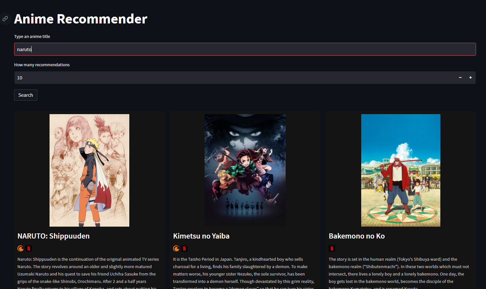

# Anime Recommendation System
Did you like an anime series and want to find similar shows? This recommendation system does it for you. Visit https://anime-flow.streamlit.app/ and test it out for yourself!

Using TensorFlow and Keras, this project creates one embedded vector for each anime, and then find similar items based off on features like title, synopsis and genres.

The data is extracted from [AniList](https://anilist.co/).


## Project Structure
- `data_handling`:
  - data_gathering.py: collects data from AniList
  - cleaning.py: prepare the data before computing the embeddings
  - streaming.py: extracts the streaming services for each anime
- `analysis`:
  - model_building.py: builds the model with TensorFlow and Keras. Computes the embeddings
  - recommender.py: find similar items for one anime. This is the backend for the application
- `app.py`: application frontend built with Streamlit


## Technologies
- **Python** 3.9
- **Scikit-learn**, **TensorFlow** and **Keras** for model building and validation
- **Streamlit** for the application (frontend)


## How to run
You can run locally:
1. Clone the repository:
   ```bash
   git clone https://github.com/eriqsp/anime-recommender.git
   cd anime-recommender
2. Install dependencies
   ```bash
   pip install -r requirements.txt
3. Create a *.env* file and add the variables:
   ```bash
   FILEPATH=?
   PARQUET_FILENAME=? 
4. (optional) Run the script below to save the streaming data
   ```bash
   python data_handling\streaming.py
5. Run the script below to save the model and anime data
   ```bash
   python analysis\model_building.py
6. Run the app
   ```bash
   streamlit run app.py


## Example
This is how the app looks like when you search an anime:



You can change how many recommendations it shows. Each card contains the anime title, the streaming services where it is available on and the synopsis.


## Why it works?
Here I'm going to dive a little deeper into what the model is actually doing.

It is a neural network constructed with TensorFlow. The neural network here is called Autoencoder. The autoencoder trains a model that reconstructs its own inputs.


*Visual depiction of the architecture of a standard autoencoder neural network. Source: IBM*

The input data and the output the data are the same, in this case being the features extracted for the animes (i.e. title, synopsis, genre, etc.).
In each training step, the model compares the input with the output (reconstructed by the decoder). Then, the parameters are updated to minimize reconstruction error.

The middle layer (bottleneck) is the embedded vector - a compressed vector that summarizes all the anime features. Basically, similar animes will have similar vector. Then I use the algorithm K-Nearest Neighbors (KNN) to find the K most similar vectors to the one being searched.